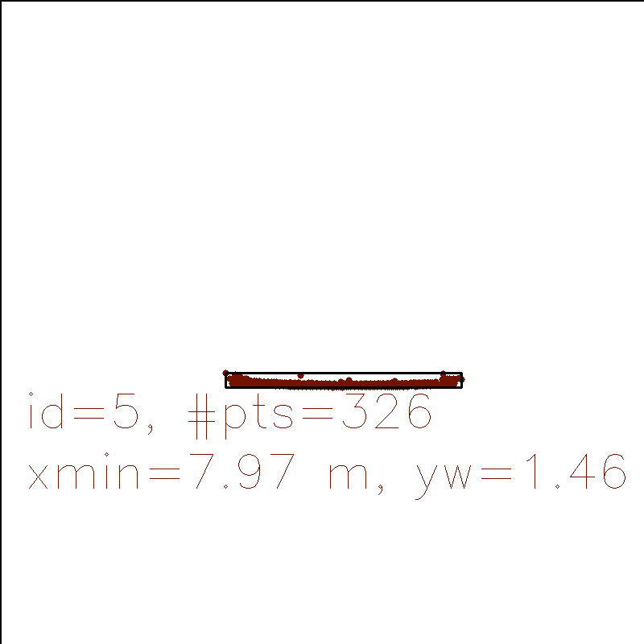
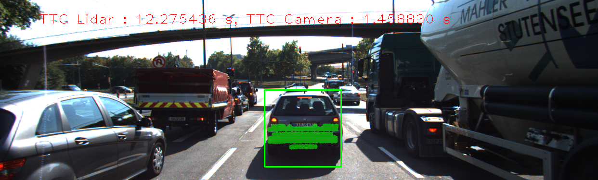
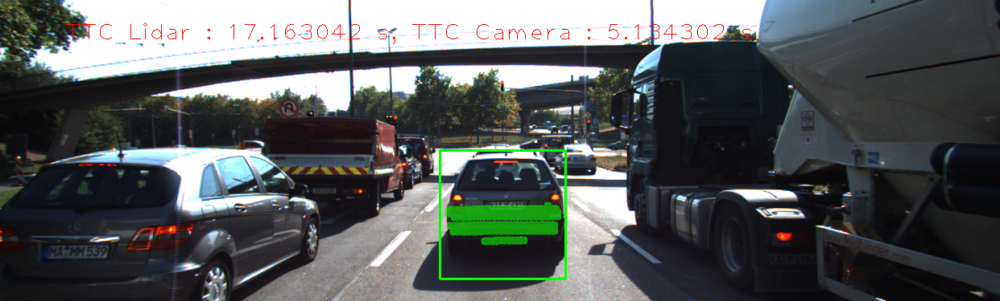

# SFND 3D Object Tracking
## Classroom Report
This repository represents my submission for the final project of the Camera module of Udacity's Sensor-fusion engineer nanodegree program. This module involves the development of TTC (time-to-collision) estimators which utilize monocular camera images and lidar data.

Notice that the file `camFusion_Student.cpp` has been imported from the previous project, in particular the implementation of the keypoint detectors/descriptors is the same. We analyse the following feature detectors and descriptors:

**Keypoint detectors:** SIFT, (Harris), (Shi-Tomasi), FAST, BRISK, ORB, and AKAZE

**Keypoint descriptors:** SIFT, BRISK, BRIEF, ORB, FREAK, AKAZE

The detectors in parenthenses were not required for the analysis but were considered nontheless.

## FP.1 Match 3D Objects
The matching of 3D objects is done in the function `matchBoundingBoxes()` in `camFusion_Student.cpp`. The central idea of tour implemented algorithm revolves around defining a occupacy matrix with dimensions ???. Since we are not importing the Eigen library for matrix computations, we simply utilize the already imported OpenCV library, in particular `cv::Mat`, which is just appropriate enough for our uses. It is initialized to zero, and for each pairing, we increment the th entry by one. 

Here, the row index corresponds to the bounding box IDs of the current image, and the column index corresponds to the `boxID`s of the previous image. An outer for-loop iterates through the keypoint matches and two inner loops iterate through the bounding boxes of the current and previous images. Whenever both the current and previous bounding boxes contain the matched keypoints, the corresponding entry in the occupancy matrix is incremented:

    for (auto match=currFrame.kptMatches.begin(); match!=currFrame.kptMatches.end(); ++match) 
    {
        cv::KeyPoint currKp = currFrame.keypoints.at(match->trainIdx);
        cv::KeyPoint prevKp = prevFrame.keypoints.at(match->queryIdx);

        for (auto currBB=currFrame.boundingBoxes.begin(); currBB!=currFrame.boundingBoxes.end(); ++currBB)
            for (auto prevBB=prevFrame.boundingBoxes.begin(); prevBB!=prevFrame.boundingBoxes.end(); ++prevBB)
                if ( currBB->roi.contains(currKp.pt) && prevBB->roi.contains(prevKp.pt) )
                    occupancy.at<int>(currBB->boxID, prevBB->boxID) += 1;
    }

Finally, in a second loop, we determine the maximum of each row (equivalently column). The index of the corresponding max (i.e. argmax) is considered the best match and inserted into `bbBestMatch`.

## FP.2 Compute Lidar-based TTC
The lidar-based computation of the TTC is done in the function `computeTTCLidar()`. 
A for-loop calculates the minimum y-coordinates of the point clouds each for the current and previous image, respectively.
In order to deal with the outlier problem, we assume the following model: We assume that the rear end of the preceding vehicle is a straight line of gradient zero, i.e. $y=const.$
Then we can calculate the normal distribution of all point cloud elements in y-direction.

$$\mathcal{N}(x;\bar{x},\sigma) \sim \exp\left( -\frac{(x-\bar{x})^2}{\sqrt{2\pi} \sigma}\right) $$

The unbiased estimate for the standard deviation is

$$ \sigma = \sqrt{\frac{1}{n-1} \sum_{i=0}^n (x_i-\bar{x})^2} $$

where $\bar{x}$ is the mean value of the sample. We say that a minimum x-points candidate $x_\mathbb{min}$ is an outliers if $x_\mathbb{min}<-2\sigma+\bar{x}$, i.e. we are discarding 2,275% of all points.

The implementation of the algorithm is done in the form of a lambda-function within `computeTTCLidar()` which we call `minVal()`. The statistically robust minimum x-values for the current and previous lidar data can then simply be calculated by calling the two lines

    double minXPrev = minVal(lidarPointsPrev);
    double minXCurr = minVal(lidarPointsCurr);

For details about `minVal()`, cf. [camFusion_Student.cpp](./camFusion_Student.cpp).

## FP.3 Associate Keypoint Correspondence with Bounding Boxes
This is done in `clusterKptMatchesWithROI()`. It is checked if both matched keypoints are contained in the ROI using the `cv::Rect2i::contains()` method. If this is the case, the keypoint match is pushed into the bounding box's `kptMatches`-vector.

## FP.4 Compute Camera-based TTC
The camera-based computation of TTC has been implemented in the function `computeTTCCamera()`. The statistical robustness of our procedure is guaranteed by the median distance ratio.

## FP.5 Performance Evaluation 1
This task dealt with finding examples where the TTC estimate of Lidar sensor is not plausible.

First of all, estimating the distance to the preceding car is error-prone, as the lens of the camera is wide-angular. However, assuming that the car on the left-hand lane is a VW Golf Stationwagon or similar, it's length according to specification is about 4.5 meters. Further assuming that its rear end is one half of the car's length ahead of us, and its front end is about the same distance as the preceding target vehicle's rear end, we can estimate the distance to the preceding car as

    4.5m + 1.5 * 4.5m = 7.75m

Hence, we estimate the distance to the rear end of the preceding car at the beginning of the scene to about 7-8 meters. This result coincides with the Lidar-results:

**Example 1**

* Detector/descriptor: FAST / BRISK
* Image 10
* TTC Lidar: 12.2754s
* TTC Camera: 1.45883s
  

**Example 2**

* Detector/descriptor: 
* Image 3
* TTC Lidar: 17.163s
* TTC Camera: 5.1343s

We believe that a large source of errors comes from the small denominator in the TTC calculations in `computeTTCCamera()`.

## FP.6 Performance Evaluation 2
This task deals with the performance evaluation of all possible detector/descriptor combinations. These are:

|              | SIFT| BRISK| BRIEF| ORB | FREAK|AKAZE|
|:------------:|:---:|:----:|:----:|:---:|:----:|:---:|
| SIFT         |     |      |      |  -  |      |  -  |
| (Harris)     |     |      |      |     |      |  -  |
| (Shi-Tomasi) |     |      |      |     |      |  -  |
| FAST         |     |      |      |     |      |  -  |
| BRISK        |     |      |      |     |      |  -  |
| ORB          |     |      |      |     |      |  -  |
| AKAZE        |  -  |  -   |   -  |  -  |   -  |     |

The exact results are contained in the [Results.ods](Results.ods) file (OpenOffice Calc).

## Dependencies for Running Locally
* cmake >= 2.8
  * All OSes: [click here for installation instructions](https://cmake.org/install/)
* make >= 4.1 (Linux, Mac), 3.81 (Windows)
  * Linux: make is installed by default on most Linux distros
  * Mac: [install Xcode command line tools to get make](https://developer.apple.com/xcode/features/)
  * Windows: [Click here for installation instructions](http://gnuwin32.sourceforge.net/packages/make.htm)
* Git LFS
  * Weight files are handled using [LFS](https://git-lfs.github.com/)
* OpenCV >= 4.1
  * This must be compiled from source using the `-D OPENCV_ENABLE_NONFREE=ON` cmake flag for testing the SIFT and SURF detectors.
  * The OpenCV 4.1.0 source code can be found [here](https://github.com/opencv/opencv/tree/4.1.0)
* gcc/g++ >= 5.4
  * Linux: gcc / g++ is installed by default on most Linux distros
  * Mac: same deal as make - [install Xcode command line tools](https://developer.apple.com/xcode/features/)
  * Windows: recommend using [MinGW](http://www.mingw.org/)

## Basic Build Instructions

1. Clone this repo.
2. Make a build directory in the top level project directory: `mkdir build && cd build`
3. Compile: `cmake .. && make`
4. Run it: `./3D_object_tracking`.